# Termin Takvimi

Partiler halinde alım yapılan mazlemelerin takibi ve işlerin detaylarını görmek için kullanılabilecek HTML tabanlı takvim uygulaması.
Gemini'a taleplerimi ileterek kodlattığım web uygulamasını, istifadenize sunuyorum.

# Uygulamanın Özellikleri

* **index.html** dosyası çalıştırıldığında aşağıdaki boş takvim ile karşılaşıyoruz. **Bugün** bilgisi, takvim üzerindeki açık sarı renk ile temsil edilir.

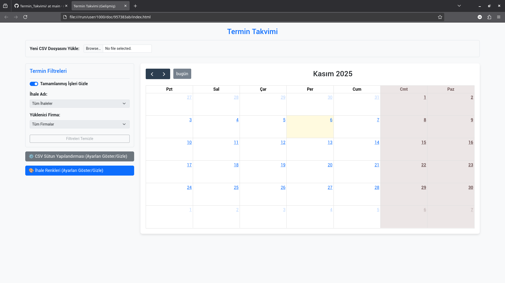

* **CSV** uzantılı **veri dosyası** seçildiğinde, dosya içeriğindeki bilgiler, takvimde ilgili yerlere yerleşiyor. Bilgi Kartları ve botunlarda bilgiler görüntüleniyor.

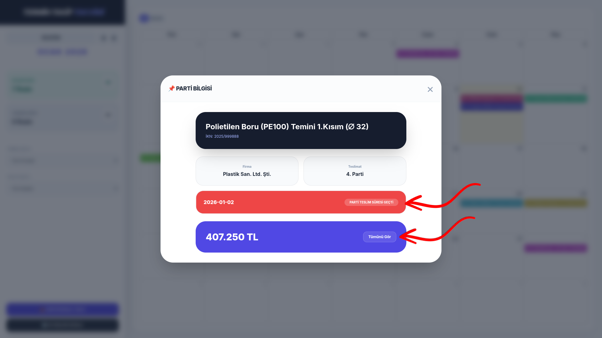

* **Tamamlanmış İşleri Gizle** seçeneği varsayılan olarak **aktif** olacak şekilde ayarlandığı için, mevcut devam eden işlere ait bilgi (İhale adı, Yüklenici adı ve Genel Özet) görüntüleniyor. Aşağıdaki resimde, **İhale Adı** açılır menüsünde sadece mevcut devam eden işlere ait bilgiler görüntüleniyor.

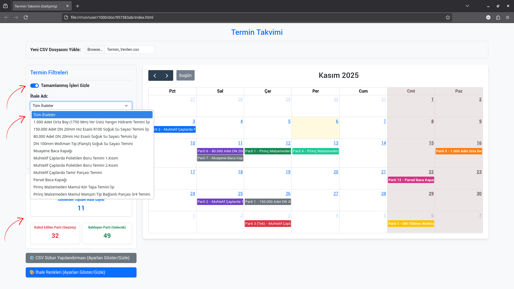

* Aşağıdaki resimde, **Yüklenici Firma** açılır menüsünde sadece mevcut devam eden işlere ait bilgiler görüntüleniyor.

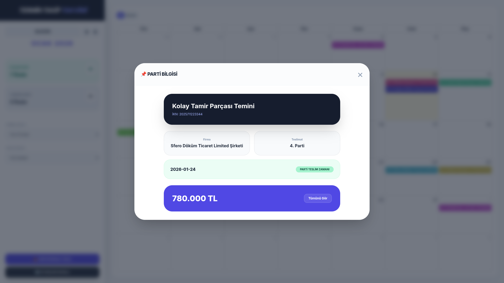

* **Tamamlanmış İşleri Gizle** seçeneği **pasifleştirilirse**, CSV dosyasındaki biten işlere ait detaylar da (yani tüm veri) hem açılır menülerde, hem özet bilgilerde hem de takvimde gösterilir. Aşağıdaki resimde, **İhale Adı** açılır menüsünde tüm işlere ait bilgiler görüntüleniyor.

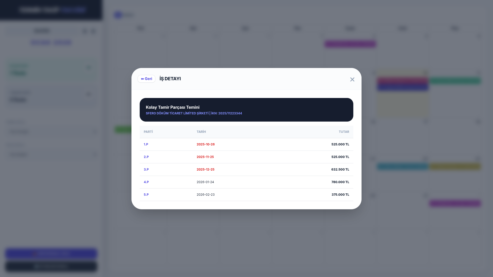

* Aşağıdaki resimde, **Yüklenici Firma** açılır menüsünde tüm işlere ait bilgiler görüntüleniyor. Bazı yüklenici firmaların hem biten hem de devam eden işleri olduğu için her halükarda menüde ismi görünür.

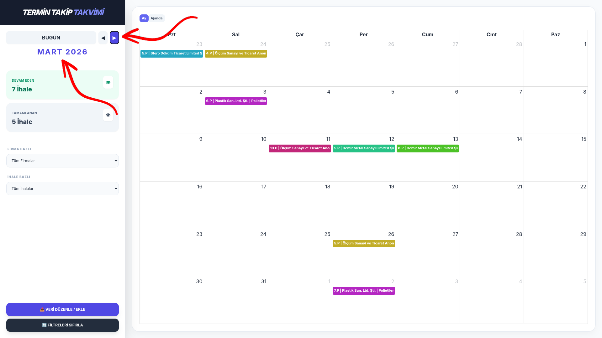

* **İhale  Adı** ya da **Yüklenici Firma** açılır menülerinden seçim yapılmadan **Kalan Termin Detaylarını Göster** butonuna tıklandığında tüm devam eden işlere (ihalelere) ait bilgilere görüntülenir.

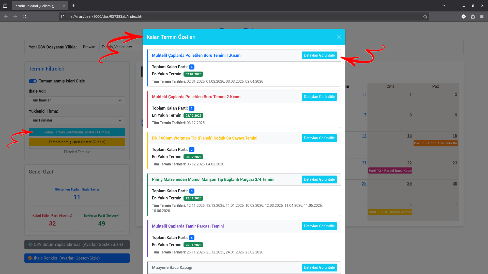

* **Detayları Görüntüle** butonuna basılırsa, ilgili işin genel bilgilerinin yanında (İhale adı, Yüklenici Firma, İhale Kayıt Numarası, Sözleşme Tutarı), ihalenin toplam kaç partiden oluştuğu, parti son teslim tarihleri, bu tarihlerin geçip geçmediği ve parti tutarları görüntülenir.

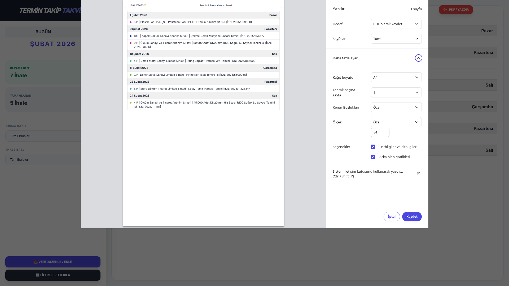

* **Tamamlanmış İşleri Göster** butonuna tıklandığında, **İhale Adı** ve **Son partinin teslim tarihi** bilgileri liste görüntülenir.

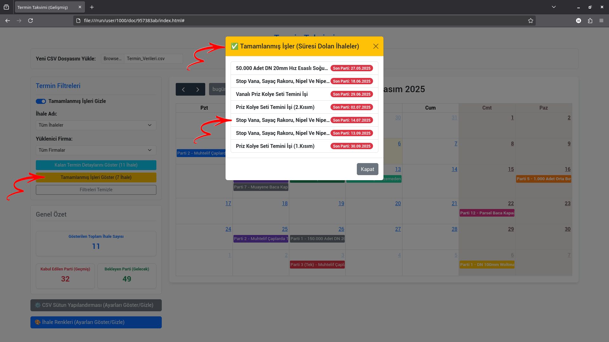

* Listede herhangi bir İş seçilirse, ilgili işin genel bilgileri yani İhale adı, Yüklenici Firma, İhale Kayıt Numarası, Sözleşme Tutarı, ihalenin toplam kaç partiden oluştuğu, partilere ait son teslim tarihleri ve parti tutarları görüntülenir.

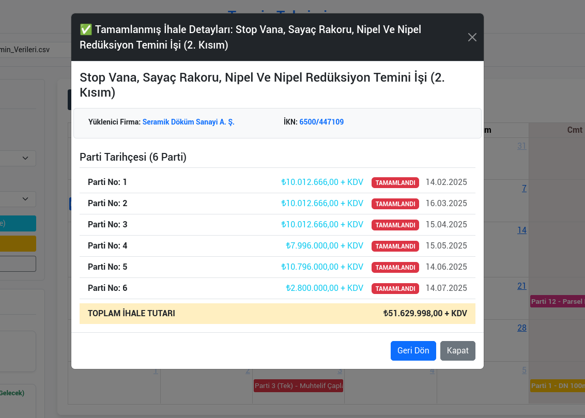

* Takvim üzerinde her iş (ihale) farklı bir renkte görüntülenir. Bir işe tıklandığında, o partiye ait detaylar görüntülenir.

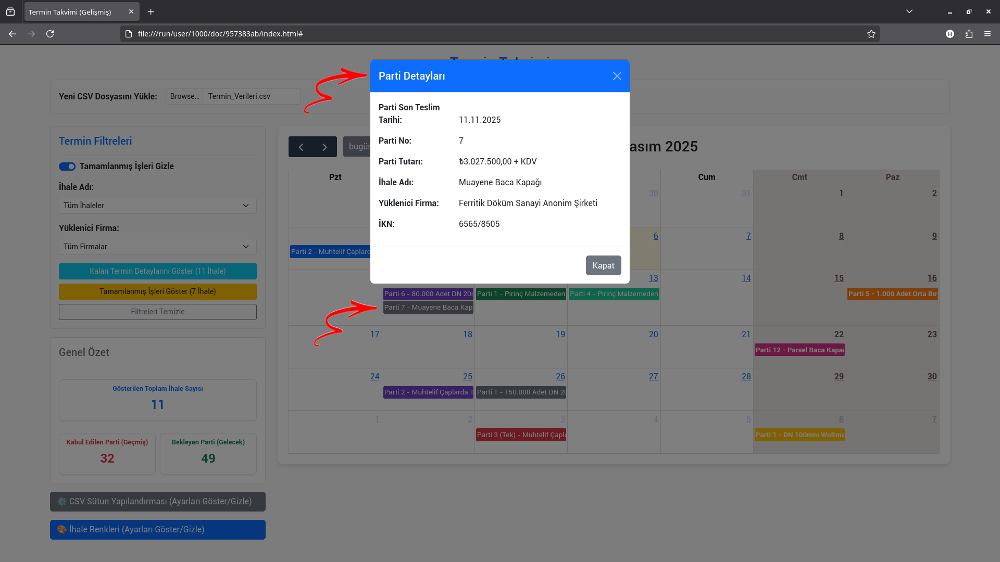

* Takvim üzerindeki **ok tuşları** yardımıyla ileri tarihlere gidilerek devam edecek işlere/partilere  ait detaylar görüntülenebilir.

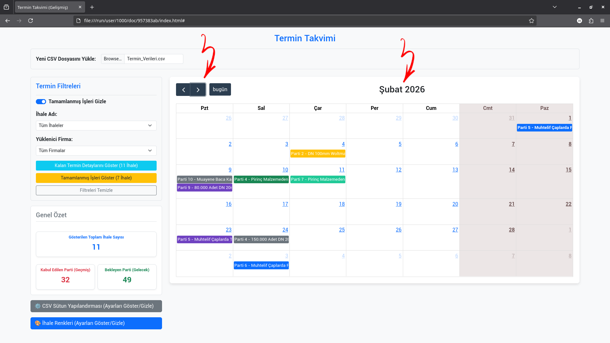

* Takvim üzerindeki **ok tuşları** yardımıyla geçmiş tarihlere gidilerek devam eden ya da biten işlere ait detaylar görüntülenebilir.

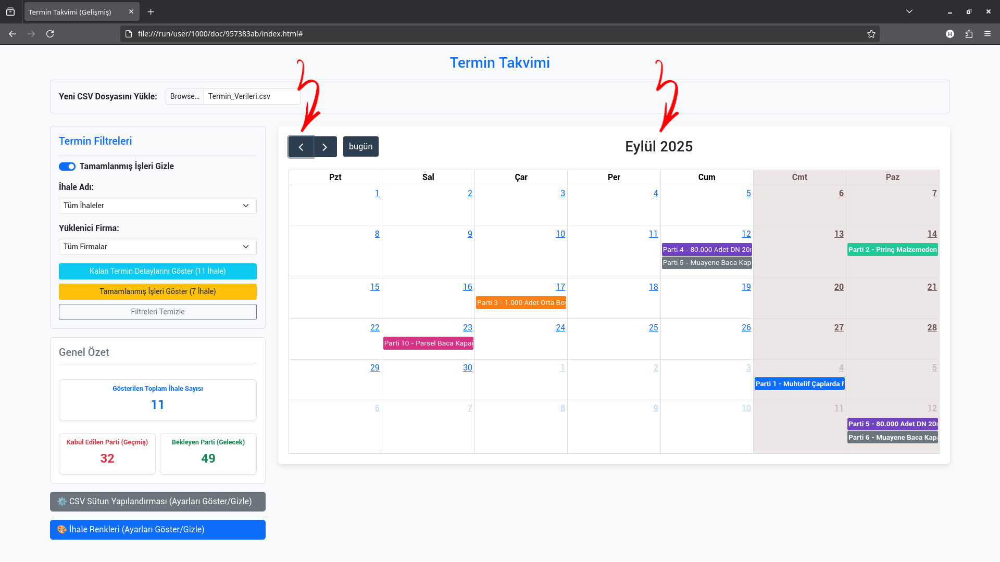

* **Yüklenici Firma** açılır menüsünden bir Yüklenici seçilirse, Takvim üzerinde sadece o Yükleniciye ait ihalelere ve parti bilgileri görüntülenir. Yani Yükleniciye filtre uygulanır. Aşağıdaki resimde, **Hassas Ölçüm San.  ve Tic. A.Ş**.'nin ihale ve parti bilgileri filtre uygulanarak gösterilmiştir. Filtreyi temizlemek için **Filtreleri Temizle** butonuna basılabilir.

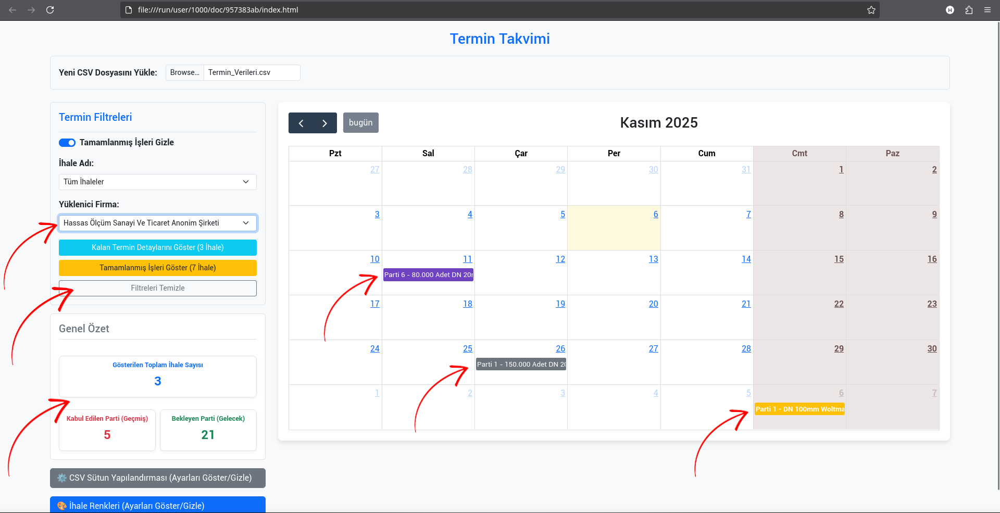

* **İhale Adı** açılır menüsünden bir İhale seçilirse, Takvim üzerinde sadece o İhaleye ait parti bilgileri görüntülenir. Yani İhale Adına filtre uygulanır. Aşağıdaki resimde, **Pirinç Malzemeden Mamul Manşon Tip Bağlantı Parçası** İşine (ihalesine) filtre uygulanarak takvim bilgisi gösterilmiştir. Filtreyi temizlemek için **Filtreleri Temizle** butonuna basılabilir.

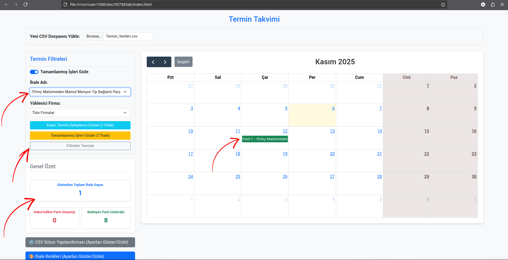

* Yüklenen CSV dosya ayarlarını değiştirebileceğiniz **CSV Sütun Yapılandırma Ayarları**nı gizleyip gösterebilirsiniz. Elinizdeki CSV dosyasının içeriğine göre, ayarları bu bölümden düzenleyebilirsiniz.

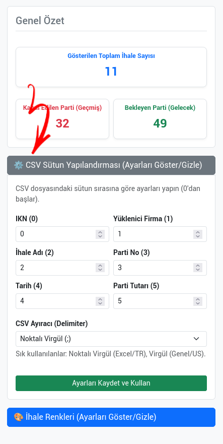

* Takvimde gösterilen İhale (iş) renklerini bu bölümden değiştirebilir / ayarlayabilirsiniz. İhale adına göre bir renk seçtikten sonra aşağıdaki **Renkleri Kaydet ve Uygula** butonuna basmalısınız. 

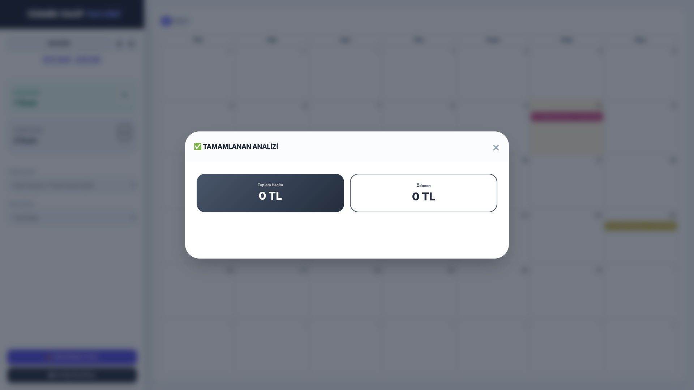

* İhale adının yanındaki renk butonuna basıldığında, kullanılan işletim sistemine ait renk seçici palet görüntülenir. Aşağıda Kubuntu Linux işletim sistemine ait renk paleti görünmektedir. Açık Mor rengi seçilip kayıt tamamlanıyor. 

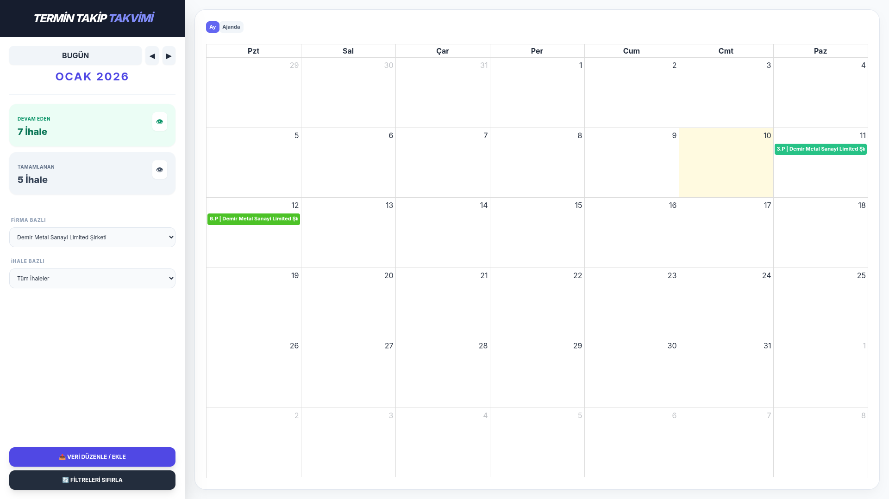

* Kayıt işlemi sonrası takvim üzerinde İlgili ihalenin rengi mor olarak görüntüleniyor. 

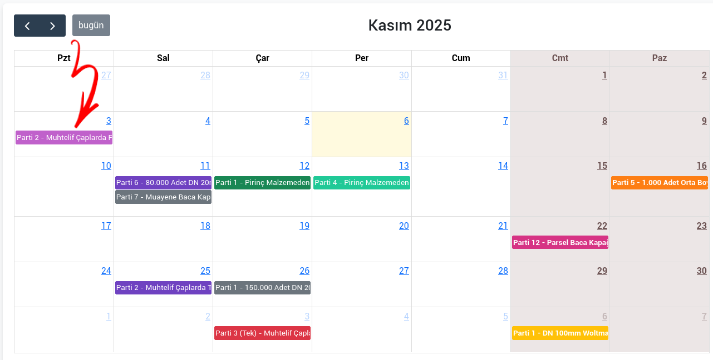
