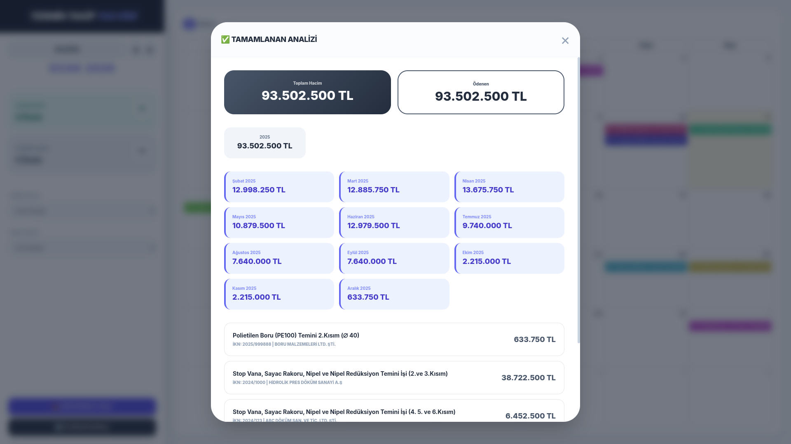
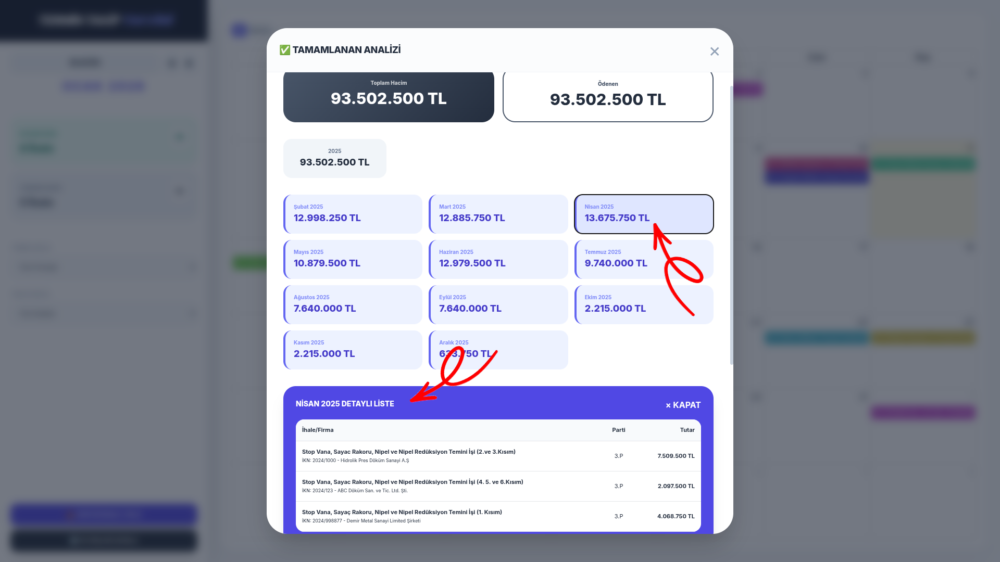

# Termin Takvimi

Partiler halinde alım yapılan mazlemelerin takibi ve işlerin detaylarını görmek için kullanılabilecek HTML tabanlı takvim uygulaması.
Gemini'a taleplerimi ileterek kodlattığım web uygulamasını, istifadenize sunuyorum.

# Uygulamanın Özellikleri

* **index.html** dosyası çalıştırıldığında aşağıdaki gibi bir takvim ile karşılaşıyoruz. **Bugün** bilgisi, takvim üzerindeki açık sarı arkaplan rengi ile temsil ediliyor.

* Takvim uygulaması (index.html) çalıştırıldığında, üzerindeki tüm veriyi aynı dizindeki **veriler.js isimli JSON**  dosyasından alıyor/okuyor.
* Takvim üzerindeki bilgilerden birine tıklandığında açılır pencere içinde İhaleye ait detaylar görüntüleniyor. Örneğin 2 Ocaktaki işe tıkladığımızda aşağıdaki pencere açılıyor. Bugün 10 Ocak olduğu için tıkladığımız termin bilgisi kırmızı arkaplan rengi ile gösteriliyor ve "PARTİ TESLİM SÜRESİ GEÇTİ" bilgisi yazıyor.

* **Tümünü Gör** butonuna basıldığında ise Geçerli iş ve yükleniciye ait detaylar görünüyor. Geçmiş tarihli parti bilgileri kırmızı renkli olarak gösterilir.

* Takvimde ileri tarihli bir işe/partiye ait bilgiye tıklarsak (örneğin 24 Ocak) açılan PARTİ BİLGİSİ penceresinde "PARTİ TESLİM ZAMANI" yazısını ve arkaplanın yeşil olduğunu görürsünüz. 

* **Tümünü Gör** butonuna basıldığında ise Geçerli iş ve yükleniciye ait detaylar görünüyor.

* Ana sayfanın sol üst kısmındaki **OK Tuşları (🡄 🡆)** ile aylar arasında gezinebilir, **BUGÜN** butonu ile de güncel güne ait aya dönebilirsiniz. Örneğin Ok tuşu ile Mart ayına gelip o aya ait iş ve parti bilgilerini görebiliri. 

* Ya da Sol Ok tuşu ile geri gidip Şubat Ayı verilerini **AJANDA** görünümünde liste halinde görebiliriz.

* **AJANDA** görünümündeyken **PDF/YAZDIR** butonuna tıklayarak o ayki faaliyetleri kolayca çıktı alacak hale getirebilir ya da yazdırabiliriz.

* Takvimin **AY** görünümüne geçerek **BUGÜN** butonuna basıyor ve ay içindeki işleri / partileri görüyoruz.

* Takvimin **AY** görünümüne geçerek **BUGÜN** butonuna basıyor ve ay içindeki işleri / partileri görüyoruz. Sol Kısımdaki "**TAMAMLANAN**" bilgi kartına tıkladığımızda, Ocak ayında tamamlanan iş olmadığı için tüm takvim boş kalıyor.

* **SOL OK** tuşu ile **Kasım** ayına geldiğimizde **DEVAM EDEN** ve **TAMAMLANAN** tüm işleri, takvim üzerinde görüyoruz. 

* Sol kısımdan **DEVAM EDEN** bilgi kartına tıklayınca, Takvimde sadece Kasım ayında devam eden işler gösterilir. Biten işle gizlenir. 

* Sol kısımdaki **FİRMA BAZLI** listesinden bir firma seçilirse, hem  **İHALE BAZLI** listesinde hem de takvim içerisinde sadece seçilen Firmaya ait işler listelenir / gösterilir.

* **FİRMA BAZLI** açılır menüsünden seçim yaptık ve takvim içeriğinde sadece seçili işe ait bilgiler gösterildi.

* **İHALE BAZLI** açılır menüsünde de sadece seçili firmaya ait işler listelendi.

* **FİRMA BAZLI** açılır menüsünden seçim yaptıktan sonra **DEVAM EDEN** bilgi kartına tıkladığımızda, sadece seçili firmaya ait devam eden işlerin detay bilgileri görüntülenir.

* Doğal olarak, **FİRMA BAZLI** açılır menüsünden seçim yapılmış iken **TAMAMLANAN** bilgi kartına tıkladığımızda da, sadece seçili firmaya ait tamamlanan işlerin detay bilgileri görüntülenir. Tamamlanan iş yoksa aşağıdaki gibi bilgi ile karşılaşırsınız.

* **FİRMA BAZLI** listesinden yeni bir firma seçelim takvimde, diğer işler gizlendi.

* **DEVAM EDEN** işlerinin detaylarını inceleyelim. 

* Aynı firmanın **TAMAMLANAN** İşlerinin detaylarını inceleyelim.

* **AY** görünümünden farklı olarak **AJANDA** görünümünde, aylık iş/parti bilgileri liste şeklinde görüntülenebilir.

* **AY** görünümünde olduğu gibi **AJANDA** görünümünde de tüm işler ya da **FİRMA BAZLI** menüsünden seçim yapılarak bir firmaya ait işler filtrelenebilir/ görüntülenebilir.

* Takvim uygulamasının güzel ve kullanışlı bir özelliği de yeni İhale bilgileri ekleme ya da mevcut ihale bilgilerini Düzenlemeye / Silmeye imkan tanımasıdır. Sol kısımda bulunan **DÜZENLE / EKLE** butonuna basarak düzenleme sayfasını görüntüleyebiliriz.

* **Dosya Seç** butonu yardımı ile mevcut ihale bilgilerinin bulunduğu dosyayı seçelim.

* Gördüğünüz gibi **JSON (.js)** dosyası yüklendi. Artık mevcut veriler üzerinde değişiklik yapabiliriz.

* Sayfanın en altına gelip son ihaleye ait bilgilere bakıyoruz. 

* Yeni işe ait bilgileri yazarak, uygulamanın,  otomatik olarak kayıt oluşturmasını sağlıyoruz. 

* Yeni işe ait bilgileri yazıp, **SİHİRBAZI ÇALIŞTIR** butonuna basarak uygulamanın, bizim için belirttiğimiz parti sayısı kadar kayıt oluşturmasını sağlıyoruz. Yazılan Sözleşme Tutarı, parti sayısına bölünerek, parti tutarları eşit olacak şekilde oluşturuluyor. İsterseniz sonrasında değerleri değiştirebilirsiniz.

* Sayfanın altına geldiğimizde yeni işe ait bilgilerin eklendiğini görüyoruz.

* **VERİLERİ JS OLARAK KAYDET** butonu yardımı ile de yaptığımız değişikliği  kaydetmek istiyoruz.

* Takvim uygulaması verileri **VERİLER.JS** dosyasından okuduğu için değişikliği aynı dosyanın üzerine kaydediyoruz.

* Sayfayı F5 tuşu ile yenilediğimizde, veriler yeniden okunuyor ve yeni eklenen işin uygulamaya dahil olduğunu görüyoruz.

* **FİRMA BAZLI** listesinde yeni işi seçip takvime filtre uyguluyoruz.

* **DEVAM EDEN** bilgi kartının yanındaki **GÖZ** simgesine tıklayarak yeni işin finansal detaylarını görüntülüyoruz.

* Firma Filtresi uygulamazsak DEVAM EDEN (AKTİF PROJEKSİYON) işlerin tamamına ait finansal detaylar görüntülenir.

* Sayfayı aşağı kaydırarak Devam eden işlerin listesini görebiliriz.

* Herhangi bir işe tıkladığımızda işe ait detaylar görüntülenir.

* **DEVAM EDEN (AKTİF PROJEKSİYON)** ekranında AY bilgisine tıklanırsa, o ay hangi firmaların kaçıncı partilerine ait ödeme yapılması gerektiğine dair detaylar da görüntülenir.

* Aynı özellikler **TAMAMLANAN** işler için de geçerlidir. **TAMAMLANAN** bilgi kartının yanındaki **GÖZ** simgesine tıklayarak, tamamlanan / biten işlerin ihale/iş detayları, toplam ödenen tutarları ve aylık detaylarını görüntüleyebiliriz.

* İstenilen **AY** kartına tıklayarak, o ay hangi firmaların hangi işlerinin kaçıncı partisine dair ödeme yapıldığını görebiliriz. 

